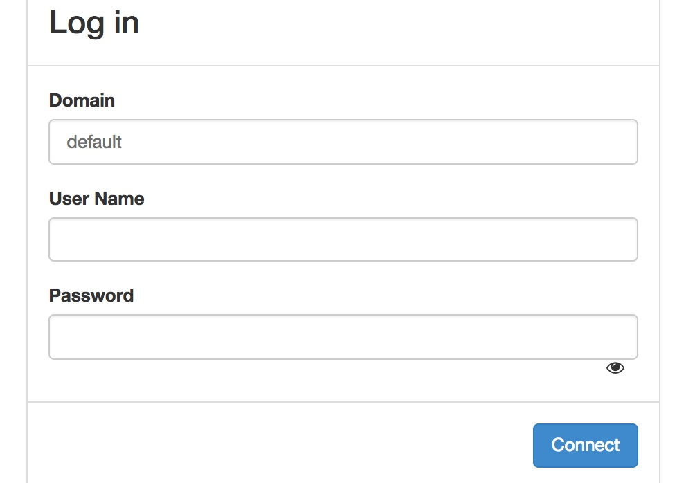
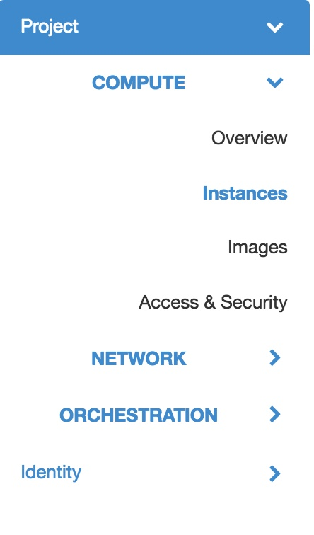
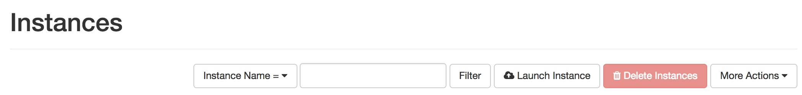
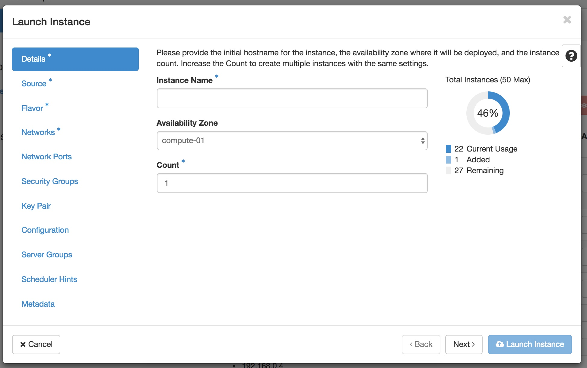
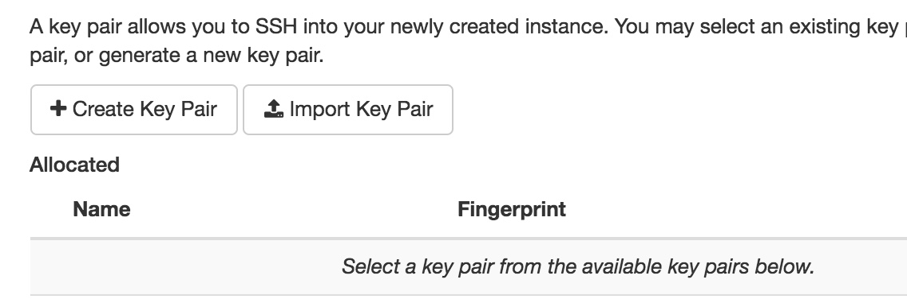

# Stratus


A Bare-Metal ansible installer for Openstack Cloud (Centos7).
The official Openstack dumentation is here: https://docs.openstack.org/ocata/install-guide-rdo/
 
WYSIWYG:

  - Identity service (Keystone)
  - Image service (Glance)
  - Compute service (Nova)
  - Dashboard (Horizon)
  - Networking service (Neutron)

These are the basic modules that are required to launch an instance and be able to  ssh to it.

# Hardware things

 - Take two servers(nodes) one will be your controller node and other, compute node
   > Minimun requirements:
     Controller Node: 1 processor, 4 GB memory, 5 GB storage and 2 Ethernet cards (say eth01 and eth02)
     Compute Node: 1 processor, 2 GB memory, and 10 GB storage and Ethernet cards (say eth01 and eth02)

 - You need two different network address space each for usage in the two Ethernet cards.
   Say, one network has the address range 10.0.0.0/24(management net) with gateway at 10.0.0.1 and another has 203.0.113.0/24(provider net) with gateway at 203.0.113.1
   Attach Ethernet cables from management net to eth01 of both Controller and compute node.
   Attach Ethernet cables from provider net to eth02 of both Controller and compute node.
   ( In centos, you'll have names as enp1s0 and enp2s0, not eth01/02 )


### Specimen /etc/sysconfig/network-scripts/ifcfg-eth01 (both controller and compute nodes)
```sh
NAME="eth01"
DEVICE="eth01"
ONBOOT=yes
NETBOOT=yes
UUID="6ae37a9a-5c81-4903-816b-0b8f86aa4542"
IPV6INIT=yes
BOOTPROTO=dhcp
TYPE=Ethernet
```


### Specimen /etc/sysconfig/network-scripts/ifcfg-eth02 (both controller and compute nodes)
```sh
NAME="eth02"
DEVICE="eth02"
ONBOOT=no
NETBOOT=yes
UUID="18a6bab4-8584-415e-a975-2486721ef829"
IPV6INIT=yes
BOOTPROTO=none
TYPE=Ethernet
NM_CONTROLLED=yes
```
- eth02 is to be kept unnumbered (but wires go in the Ethernet card), as you can see in the provided specimen of network-scripts

### Output of 'ip a' command on both controller and compute nodes

The output shall look somthing like this:

```sh
1: lo: <LOOPBACK,UP,LOWER_UP> mtu 65536 qdisc noqueue state UNKNOWN 
    link/loopback 00:00:00:00:00:00 brd 00:00:00:00:00:00
    inet 127.0.0.1/8 scope host lo
       valid_lft forever preferred_lft forever
    inet6 ::1/128 scope host 
       valid_lft forever preferred_lft forever
2: eth01: <BROADCAST,MULTICAST,UP,LOWER_UP> mtu 1500 qdisc pfifo_fast state UP qlen 1000
    link/ether 1c:1b:0d:14:db:98 brd ff:ff:ff:ff:ff:ff
    inet 10.0.0.3/24 brd 10.0.0.255 scope global dynamic enp1s0
       valid_lft 86044sec preferred_lft 86044sec
    inet6 fe80::1e1b:dff:fe14:db98/64 scope link 
       valid_lft forever preferred_lft forever
3: eth02: <BROADCAST,MULTICAST> mtu 1500 qdisc noop state DOWN qlen 1000
    link/ether 00:e0:4c:04:0f:0e brd ff:ff:ff:ff:ff:ff
```
- Here you can see ( in the above excerpt), eth02 is kept unnumbered, i.e. no IP address for eth02.

- If you do not have two different networks such as 10.0.0.0/24 and 203.0.113.0/24. You can split your existing network say w.x.y.z/24 and create a new net range with
  another router.


Now,

# Edit the configurations

You need to care about two files, to configure according to your setup requirement.
First,
 - ### In file group_vars/simple-setup, change

```sh
   controller: <controller-ip>
   compute: <compute-ip>
   management_subnet: <management-net> like 10.0.0.0/24
   COMMON_PROVIDER_INTERAFACE: <management-net-ethernet-device-name> like eth01
```

If we want a floating ip pool of say 90 IPs, we can set the provider subnet range like the following:

```sh
  #Provider
  start_provider_subnet_pool_ip: <start-ip-range-for-floating-ip> like 203.0.113.10
  end_provider_subnet_pool_ip: <end-ip-range-for-floating-ip> like 203.0.113.100
  provider_dns: 8.8.8.8
  provider_gateway: <gateway-ip-of-provider-node> like 203.0.113.1
  provider_subnet_cidr: <provider-net-range> like 203.0.113.0/24
```
Then,
The self-service network config, can also be changed accordingly, but you may choose to leave
the IP ranges as present by default, which is,  

```sh
   # Self service
   selfservice_gateway: 192.168.0.1
   selfservice_cidr: 192.168.0.0/24
```
This means your instances will be assigned private IPs in this range.

Lastly,
 - ### In the inventory file, change/set
   ansible_ssh_host value according to your controller and compute node IPs and also ansible_ssh_pass 

```sh
   [controllers]
   # set your controller node IP and the root password for the node
   controller ansible_ssh_host=10.0.0.3 controller_id=1 ansible_ssh_pass=changeme


   # Set your compute node IP and the root password for the node
   [computes]
   compute ansible_ssh_host=10.0.0.5 compute_id=1 ansible_ssh_pass=changeme
```


# Execution

```sh
ansible-playbook site.yml -i inventory
```

# About your cirros instance
  We are downloading a cirros image and the user-password combo for SSH is:
  - User: cirros
  -  Password: cubswin:)

# Launching an instance
  Log into the Horizon dashboard at such an address:
  - http://controller/dashboard (Where controller is the IP address of your controller node)

  Steps to launch your first cirros instance:
  1) Logging in with credentials of demo user. You can find this in group_vars/simple-setup file, under section #RC.
     It looks something like this,
```sh       
demorc:
  OS_PROJECT_DOMAIN_NAME: Default
  OS_USER_DOMAIN_NAME: Default
  OS_PROJECT_NAME: demo
  OS_USERNAME: demo
  OS_PASSWORD: DM_PASS
  OS_AUTH_URL: http://controller:35357/v3
  OS_IDENTITY_API_VERSION: 3
  OS_IMAGE_API_VERSION: 2
```
  Here,
    Domain: default
    User Name: demo
    Password: DM_PASS 
      
   
  2) Go to instances tab on your left.
  
    

  3) Click on launch instance button.
  
    

  4) You'll get such a launch panel.
  
    

  5) Getting the key pair for your instance, among other things,

    

    Create a new key pair, download the .pem file, which you'll use to log into your instance.
    Once a key pair is created, it will appear in the list of keypairs below. Click in "+" icon to use
    it for your instance. 
